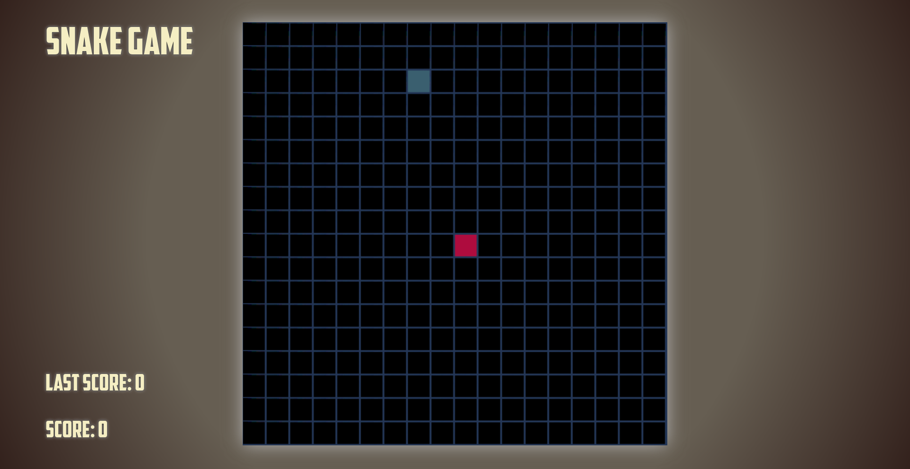

<a id="readme-top"></a>

[![Contributors][contributors-shield]][contributors-url]
[![Forks][forks-shield]][forks-url]
[![Stargazers][stars-shield]][stars-url]
[![Issues][issues-shield]][issues-url]
[![MIT License][license-shield]][license-url]
[![LinkedIn][linkedin-shield]][linkedin-url]


<!-- PROJECT LOGO -->
<br />
<div align="center">
  <a href="https://github.com/Sirius2051/snakeGameJS">
    
  </a>

  <h3 align="center">Snake Game JS</h3>

  <p align="center">
    A simple Snake Game with basic web technologies
    <br />
    <br />
    <br />
    <a href="https://sirius-snakeGameJS.netlify.app/">View Demo</a>
    ·
    <a href="https://github.com/Sirius2051/snakeGameJS/issues/new?labels=bug&template=bug-report---.md">Report Bug</a>
    ·
    <a href="https://github.com/Sirius2051/snakeGameJS/issues/new?labels=enhancement&template=feature-request---.md">Request Feature</a>
  </p>
</div>


<!-- TABLE OF CONTENTS -->
<details>
  <summary>Table of Contents</summary>
  <ol>
    <li>
      <a href="#about-the-project">About The Project</a>
      <ul>
        <li><a href="#built-with">Built With</a></li>
      </ul>
    </li>
    <li>
      <a href="#getting-started">Getting Started</a>
      <ul>
        <li><a href="#prerequisites">Prerequisites</a></li>
        <li><a href="#installation">Installation</a></li>
      </ul>
    </li>
    <li><a href="#license">License</a></li>
    <li><a href="#contact">Contact</a></li>
  </ol>
</details>


<!-- ABOUT THE PROJECT -->
## About The Project

This is just a Snake Game, there’s not much to say.


<p align="right">(<a href="#readme-top">back to top</a>)</p>


### Built With

These are the technologies used for it:

* [![HTML][HTML]][HTML-url]
* [![CSS][CSS]][CSS-url]
* [![JS][JS]][JS-url]

<p align="right">(<a href="#readme-top">back to top</a>)</p>

## Getting Started

To get a local copy up and running follow these simple example steps.

### Prerequisites

You only need a web browser.

### Installation

1. Clone the repo
   ```sh
   git clone https://github.com/Sirius2051/snakeGameJS.git
   ```
2. Open the `index.html` file in your web browser

3. Done. :)

<p align="right">(<a href="#readme-top">back to top</a>)</p>

<!-- LICENSE -->
## License

Distributed under the ![license-shield]. See `LICENSE` for more information.

<p align="right">(<a href="#readme-top">back to top</a>)</p>


<!-- CONTACT -->
## Contact

Sirius - [@Sirius2051](https://twitter.com/Sirius2051) - sirius2051@protonmail.ch

<p align="right">(<a href="#readme-top">back to top</a>)</p>


<!-- MARKDOWN LINKS & IMAGES -->
<!-- https://www.markdownguide.org/basic-syntax/#reference-style-links -->
[contributors-shield]: https://img.shields.io/github/contributors/Sirius2051/snakeGameJS.svg?style=for-the-badge
[contributors-url]: https://github.com/Sirius2051/snakeGameJS/graphs/contributors
[forks-shield]: https://img.shields.io/github/forks/Sirius2051/snakeGameJS.svg?style=for-the-badge
[forks-url]: https://github.com/Sirius2051/snakeGameJS/network/members
[stars-shield]: https://img.shields.io/github/stars/Sirius2051/snakeGameJS.svg?style=for-the-badge
[stars-url]: https://github.com/Sirius2051/snakeGameJS/stargazers
[issues-shield]: https://img.shields.io/github/issues/Sirius2051/snakeGameJS.svg?style=for-the-badge
[issues-url]: https://github.com/Sirius2051/snakeGameJS/issues
[license-shield]: https://img.shields.io/github/license/Sirius2051/snakeGameJS.svg?style=for-the-badge
[license-url]: https://github.com/Sirius2051/snakeGameJS/blob/master/LICENSE.txt
[linkedin-shield]: https://img.shields.io/badge/-LinkedIn-black.svg?style=for-the-badge&logo=linkedin&colorB=555
[linkedin-url]: https://linkedin.com/in/Sirius2051
[product-screenshot]: assets/img/backgroun.jpg
[HTML]: https://img.shields.io/badge/html-F64A1D?style=for-the-badge&logo=html5&logoColor=white
[HTML-url]: https://developer.mozilla.org/es/docs/Learn/HTML
[CSS]: https://img.shields.io/badge/css-39ACDD?style=for-the-badge&logo=css3&logoColor=white
[CSS-url]: https://developer.mozilla.org/es/docs/Learn/CSS
[JS]: https://img.shields.io/badge/Javascript-EFD81D?style=for-the-badge&logo=javascript&logoColor=black
[JS-url]: https://developer.mozilla.org/es/docs/Learn/JavaScript